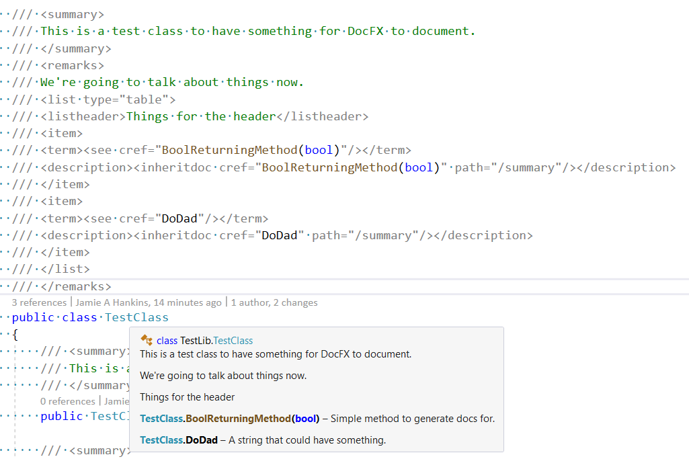

**Simple Repro of DocFX Bug**

 DocFX does not render `<inheritdoc>` tags when they are in a table, in a `<description>` tag.

 It also doesn't render `<listheader>` items.

 To build, simply run build.cmd.

 Here is the HTML that is rendered for the TestClass documentation:
 (reformatted for clarity)
 ```HTML
 <div class="markdown level1 remarks">
    <p>We're going to talk about things now.</p>
    <table>
        <thead>
        <tr>
        <td>Things for the header</td>
        </tr>
        </thead>
        <tbody>
        <tr>
        <td>
        <a class="xref" href="TestLib.TestClass.html#TestLib_TestClass_BoolReturningMethod_System_Boolean_">
        BoolReturningMethod(Boolean)</a>
        </td>
        <td>Simple method to generate docs for.</td>
        </tr>
        <tr>
        <td><a class="xref" href="TestLib.TestClass.html#TestLib_TestClass_DoDad">DoDad</a></td>
        <td>A string that could have something.</td>
        </tr>
        </tbody>
    </table>
</div>
```

Here is what should have been rendered:
(reformatted for clarity)
```HTML
<div class="markdown level1 remarks">
    <p>We're going to talk about things now.</p>
    <table>
        <thead>
        <tr>
        <td>Things for the header</td>
        </tr>
        </thead>
        <tbody>
        <tr>
        <td><a class="xref"
            href="TestLib.TestClass.html#TestLib_TestClass_BoolReturningMethod_System_Boolean_">
        BoolReturningMethod(Boolean)</a></td><td>
        <inheritdoc cref="M:TestLib.TestClass.BoolReturningMethod(System.Boolean)" path="/summary"></inheritdoc></td>
        </tr>
        <tr>
        <td><a class="xref" href="TestLib.TestClass.html#TestLib_TestClass_DoDad">DoDad</a>
        </td>
        <td>
        <inheritdoc cref="P:TestLib.TestClass.DoDad" path="/summary"></inheritdoc>
        </td>
        </tr>
        </tbody>
    </table>
</div>
```
Here is how Visual Studio renders the "triple-slash" comments for this class.
 